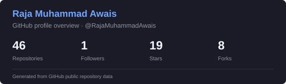
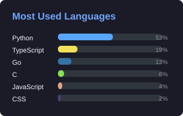
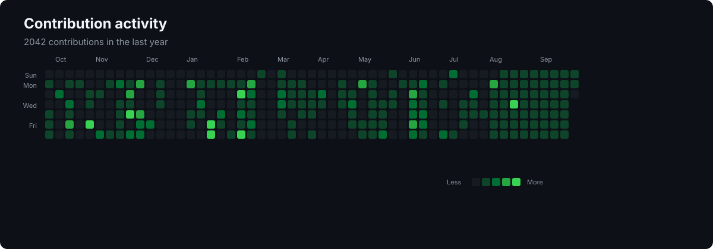

  

<!-- ===================== ABOVE THE FOLD - HOOK & VALUE PROPOSITION ===================== -->

<h1 align="center">Raja Muhammad Awais</h1>
<h2 align="center">DevOps Engineer • AI Engineer • Cyber Security Researcher • Cloud & Kubernetes Architect • RAG Systems Engineer</h2>

  <em>Architecting secure, intelligent infrastructure at the intersection of Cloud DevOps, Artificial Intelligence, and Offensive Security.</em>

  
  
  
  

---

<!-- ===================== ABOUT ME - PAS FRAMEWORK (PROBLEM → AGITATION → SOLUTION) ===================== -->

## 🚀 About Me — The DevOps, AI & Security Engineer You Need

### The Problem

> Organizations today face a critical challenge: **how to build and maintain cloud infrastructure that is scalable, intelligent, and secure** — without slowing down innovation. Legacy DevOps pipelines lack AI-driven automation, and security is often treated as an afterthought rather than a core design principle.

### What I Bring

I am **Raja Muhammad Awais**, a multi-disciplinary **DevOps Engineer, AI Engineer, and Cyber Security Researcher** who bridges these three worlds. I architect **cloud-native infrastructure** on **AWS and Azure** using **Kubernetes, Docker, and Terraform**, build **intelligent RAG pipelines** with **LangChain and vector databases**, and apply **offensive security methodologies** to harden systems before attackers can exploit them.

### My Track Record

- ✅ **Proven Open Source Contributor** — Merged PRs into `k8snetworkplumbingwg/sriov-cni`, the SR-IOV Container Network Interface for Kubernetes
- ✅ **Cloud-Native Architect** — Designed end-to-end IoT healthcare platforms running on Kubernetes with real-time AI inference
- ✅ **AI Pipeline Engineer** — Built production-scale Retrieval-Augmented Generation (RAG) systems for enterprise document Q&A
- ✅ **Security Researcher** — Deep expertise in Kali Linux, penetration testing, network scanning, and adversarial ML

### Let's Build Something Resilient

> *"Security is not a product, but a process. DevOps is not a role, but a culture."*

---

<!-- ===================== TECH STACK - SEO OPTIMIZED WITH SEMANTIC KEYWORDS ===================== -->

## 🛠️ Technical Skills & Expertise

### ☁️ Cloud Infrastructure & DevOps
<!-- Cloud computing, infrastructure as code, container orchestration keywords -->

### 💻 Programming Languages & Scripting

### ⚙️ CI/CD Pipelines & Version Control Systems

### 🖥️ Operating Systems & Platforms

### 📊 Monitoring, Observability & Logging

### 🛡️ Network Analyzer & Penetration Testing Tools

### 🤖 Artificial Intelligence & Data Engineering

---

<!-- ===================== FEATURED PROJECTS - PROOF POINTS WITH SOCIAL PROOF ===================== -->

## 🎯 Featured Projects & Open Source Work

<table>
  <tr>
    <td width="50%">
      <h3>🔐 Healthcare IoT Realtime Platform</h3>
      
<strong>Tech Stack:</strong> Python, Kubernetes, Docker, AI Inference

      
End-to-end real-time health monitoring platform that leverages IoT sensor data streams, runs AI inference pipelines for anomaly detection, and deploys securely on Kubernetes clusters with auto-scaling and self-healing infrastructure.

      

        
        
        
        
      

    </td>
    <td width="50%">
      <h3>🛡️ SR-IOV CNI — Kubernetes Network Plugin</h3>
      
<strong>Contribution:</strong> Open Source • Dependabot Automation

      
Contributed to the official <code>k8snetworkplumbingwg/sriov-cni</code> repository — the SR-IOV Container Network Interface plugin for Kubernetes. Configured automated dependency management via Dependabot to ensure secure, up-to-date network virtualization for containerized workloads.

      

        
        
        
      

      

        <a href="https://github.com/k8snetworkplumbingwg/sriov-cni/pull/335"><strong>PR #335</strong></a> — Dependabot configuration 
        <a href="https://github.com/k8snetworkplumbingwg/sriov-cni/pull/343"><strong>PR #343</strong></a> — Weekly dependency updates
      

    </td>
  </tr>
  <tr>
    <td width="50%">
      <h3>🧠 AI RAG Pipeline — Enterprise Document Q&A</h3>
      
<strong>Tech Stack:</strong> LangChain, Vector Databases, PostgreSQL, Docker

      
Production-scale Retrieval-Augmented Generation (RAG) pipeline that enables intelligent question-answering over enterprise documents. Uses LangChain for orchestration, vector embeddings for semantic search, and containerized deployment for scalability.

      

        
        
        
        
      

    </td>
    <td width="50%">
      <h3>🐉 Kali Linux Hacker Desktop </h3>
      
<strong>Tech Stack:</strong> SVG Animation, CSS, Design Engineering

      
Full Kali Linux 2024.2 desktop simulation in pure SVG — featuring animated boot sequence, Anonymous hacker ASCII art with glowing eyes, interactive terminal showing <strong>rajamuhammadawais</strong> identity with step-by-step networking commands (whoami, id, ifconfig, ip a, route -n, ping, nmap), live system monitor with CPU/Memory/Network graphs, and Thunar file manager.

      

        
        
        
      

    </td>
  </tr>
  <tr>
    <td width="50%">
      <h3>⚡ DPDK-nDPI Traffic Analysis Lab</h3>
      
<strong>Tech Stack:</strong> DPDK, nDPI, ELK Stack, C, Python

      
Research-grade laboratory environment for high-speed network traffic classification. Integrates <strong>DPDK</strong> (Data Plane Development Kit) for kernel-bypass packet capture and <strong>nDPI</strong> for deep application-layer protocol identification with JA4+ TLS fingerprinting and stateful flow tracking using DPDK's <code>rte_hash</code>.

      

        
        
        
        
      

      

        <a href="https://github.com/RajaMuhammadAwais/dpdk-ndpi-traffic-analysis-lab"><strong>View Repository →</strong></a>
      

    </td>
    <td width="50%">
      <h3>🚨 Real-Time Network Anomaly Detection</h3>
      
<strong>Tech Stack:</strong> DPDK, nDPI, Python, Machine Learning, libpcap

      
Full-stack security monitoring platform that leverages high-performance packet capture via <strong>DPDK/libpcap</strong> and incorporates <strong>Deep Packet Inspection (DPI)</strong> for payload signature analysis and botnet heuristics detection. Enables real-time threat identification at wire speed.

      

        
        
        
        
      

      

        <a href="https://github.com/RajaMuhammadAwais/real-time-network-anomaly-detection"><strong>View Repository →</strong></a>
      

    </td>
  </tr>
</table>

---

<!-- ===================== GITHUB STATISTICS - SOCIAL PROOF ===================== -->

## 📊 GitHub Statistics & Contribution Analytics

  
  

  
  

---

<!-- ===================== OPEN SOURCE CONTRIBUTIONS ===================== -->

## 🌟 Open Source Impact — Kubernetes Ecosystem

### SR-IOV CNI — k8snetworkplumbingwg/sriov-cni

As an open source contributor to the Kubernetes networking ecosystem, I configured and maintain automated dependency management for the SR-IOV Container Network Interface plugin. This ensures that Kubernetes clusters using SR-IOV for high-performance networking receive timely security updates and dependency upgrades.

| Pull Request | Description | Impact | Status |
|:---|:---|:---|:---:|
| [#335](https://github.com/k8snetworkplumbingwg/sriov-cni/pull/335) | Dependabot configuration for automated Go module & GitHub Actions dependency updates | Enables continuous security patching | ✅ Merged |
| [#343](https://github.com/k8snetworkplumbingwg/sriov-cni/pull/343) | Weekly dependency update cycle — Go modules and CI/CD workflows | Maintains up-to-date build pipeline | ✅ Merged |

---

<!-- ===================== FEATURED ASSETS ===================== -->

## 🎬 Animated Desktop Banners — Side by Side

> Professionally crafted animated SVG banners for GitHub profiles. Features boot sequences, hacker ASCII art, networking command simulations, live system monitors, and file manager interfaces.

<table>
  <tr>
    <td width="50%" align="center">
      
       
      <strong>🌙 Linux Desktop — Dark Theme</strong>
       
      Ubuntu-style dark desktop with hacker ASCII art
    </td>
    <td width="50%" align="center">
      
       
      <strong>☀️ Linux Desktop — Light Theme</strong>
       
      Ubuntu-style light desktop with hacker ASCII art
    </td>
  </tr>
</table>

---

<!-- ===================== CALL TO ACTION ===================== -->

## 📬 Let's Connect — Collaborate, Innovate, Secure

I am actively open to collaboration on **open-source DevOps tools, AI/ML infrastructure, and cyber security research**. Whether you need a cloud architect, an AI pipeline engineer, or a security researcher — let's build something resilient together.

  
  
  

---

  <strong>DevOps Engineer • AI Engineer • Cyber Security Researcher • Cloud & Kubernetes Architect • RAG Systems Engineer</strong>
   
  <em>Architecting secure, intelligent, and scalable infrastructure — one commit at a time.</em>

